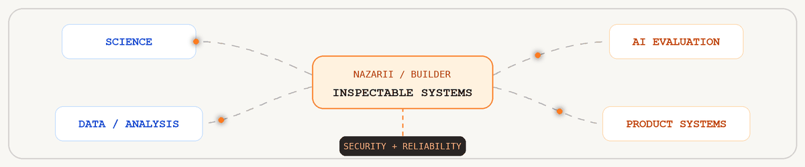

```text
$ profile --show

Name.........Nazarii Hafych
Location.....Kraków, Poland
Timezone.....CET / CEST
Training.....Theoretical physics
Primary......Mathematics intelligence / theoretical physics
AI_roles.....LLM evaluator / mathematics expert / prompt engineer
Engineering..Python developer / Flutter product engineer
Evidence.....4,000+ reviewed math tasks / undergraduate -> PhD
Mode.........Physics / data / AI / security / product systems
Status.......Open to data / research / AI / engineering
```

<details>
<summary><strong>01–02 / PROFILE + ROLE MAP</strong> — background, current work, and technical scope</summary>

<br>

### 01 / PROFILE

Physicist by training, practical builder by habit. I work where numerical
reasoning meets useful software: scientific computing, quantitative analysis,
AI evaluation, automation, and cross-platform product development.

Professionally, I evaluate mathematical reasoning in AI systems, design prompts
for rigorous solutions, review model responses against academic standards, and
turn quality findings into reproducible evidence for model improvement.

I prefer systems that make assumptions, outputs, and failure modes visible.
The goal is not only to produce an answer, but to make the result inspectable,
reproducible, and trustworthy.

### 02 / ROLE MAP

<p align="center">
  
</p>

```text
Science......Theoretical physics / scientific computing / cosmology
Analysis.....Data exploration / quantitative methods / visualization
AI...........LLM evaluation / prompt engineering / benchmark design
Product......Flutter / Dart mobile and desktop applications
Backend......Python APIs / async workflows / auth / reports
Full_stack...Flutter clients / Python services / storage / delivery
Security.....Recon automation / secure storage / P2P hardening
Documents....PDF / OCR / scanning / annotation / searchable export
Publishing...Writing systems / collaboration / DOCX / EPUB / FDX
Media........Recording / FFmpeg / offline speech recognition / waveform UX
Provenance...Watermarking / steganography / C2PA / survival metrics
Optimization.Route planning / time windows / cost models / reports
Reliability..Unit / integration / fuzz tests / recovery paths
Delivery.....Docker / CI / release builds / stores / subscriptions
Education....Mathematics teaching / physics content / scriptwriting
Docs.........Operator guides / threat models / architecture maps / policy
```

</details>

<details>
<summary><strong>03 / PROFESSIONAL + GIT HISTORY</strong> — roles, progression, and delivery signal</summary>

<br>

### PROFESSIONAL TIMELINE

```text
2020-2021....Editor-scriptwriter / physics books and educational videos
2023-2025....Mathematics tutor / undergraduate and high-school students
2025.........Mathematics Intelligence Engineer + Mathematics Expert / Mercor
2026.........Physics Expert (SQP) / Mercor
```

### GIT TIMELINE

The Git history shows a clear progression rather than a collection of isolated
experiments.

```text
2024.........Application and game prototypes
2025.........Python / notebooks / Django / scientific analysis
2026.........Dart-heavy product systems / security / media / releases
Snapshot.....74 repositories / 1,200+ default-branch commits
Core.........36 Dart repositories / 20 Python repositories
Pattern......Build -> modularize -> test -> harden -> prepare release
```

Recent history repeatedly moves projects from MVP work into modular
architecture, failure recovery, security review, test coverage, localization,
accessibility, release gates, and store readiness.

</details>

<details>
<summary><strong>04–05 / PRODUCT + APPLIED SYSTEMS</strong> — private product work and domain systems</summary>

<br>

### 04 / PRODUCT SYSTEMS

Most recent product repositories are private. Their code and history show work
across several complete product surfaces:

```text
Writing......Large-document editor / wiki / collaboration / cloud conflicts
Export.......Markdown / Fountain / Final Draft / PDF / DOCX / EPUB
Audio........Recording / multitrack / VAD / waveform editing / transcription
Speech.......Offline Whisper and native speech-processing integrations
PDF..........Local processing / forms / overlays / OCR / annotations
Scanning.....Multi-page capture / crop / signatures / encrypted backup
Privacy......Device identity / secure key stores / biometric key wrapping
P2P..........Encrypted messaging / Tor signaling / WebRTC hardening
Trust........Watermarks / steganography / C2PA / PSNR / survival tests
Business.....Auth / roles / approvals / billing / entitlements / exports
```

### 05 / APPLIED SYSTEMS

```text
Security.....Multi-tool scan orchestration / findings / HTML reports
Routing......Vehicle routes / costs / time windows / JSON / CSV / HTML
Measure......Authenticated approvals / photos / PDF project reports
Local........Offline-first data paths / private processing / recovery
AI_apps......Summaries / AI editor actions / transcript insights
```

These projects add a second engineering axis beyond UI work: domain models,
validation, orchestration, asynchronous operations, authentication, storage,
structured output, and end-to-end tests.

</details>

<details>
<summary><strong>06–07 / AI EVALUATION + ENGINEERING</strong> — evaluation method and delivery practice</summary>

<br>

### 06 / AI EVALUATION

I evaluate models as systems rather than demos. Fluency is useful only when the
answer is also correct, consistent, calibrated, and robust.

At Mercor, I evaluated the mathematical accuracy and reasoning quality of
Meta's Llama model responses across more than 4,000 tasks, from undergraduate
material to PhD-level mathematics. I also designed mathematical prompts,
prepared structured solutions in LaTeX, and produced detailed QA reports for
benchmarking and model refinement.

```text
Current......Physics Expert (SQP) / response accuracy / level appropriateness
Scale........4,000+ reviewed mathematical tasks
Range........Undergraduate -> PhD
Models.......Meta Llama / mathematical reasoning evaluation
Prompts......Rigorous solution elicitation / structure / LaTeX / pedagogy
Reports......QA findings / academic standards / benchmarking evidence
Correctness..Is the result mathematically, logically, and factually sound?
Reasoning....Do the intermediate steps support the conclusion?
Reliability..Does the method survive edge cases and adversarial inputs?
Calibration..Does confidence match the available evidence?
Diagnostics..Can failures be reproduced and turned into better tests?
Rubrics......Are quality criteria explicit and consistently applicable?
```

### 07 / ENGINEERING PRACTICE

```text
Architecture.Feature modules / services / repositories / controllers
Testing......Unit / integration / widget / fuzz / release-readiness
Security.....Threat models / log redaction / secure defaults / audits
Quality......Static analysis / coverage gates / regression suites
UX...........Desktop and mobile flows / localization / accessibility
Release......CI / signed builds / TestFlight / Play Store / RevenueCat
Operations...Docker / structured logs / JSONL / operator documentation
```

</details>

<details>
<summary><strong>08–09 / TOOLBOX + WORKFLOW</strong> — stack and working method</summary>

<br>

### 08 / TOOLBOX

```text
Languages....Python / Dart / SQL / Bash / JavaScript / TypeScript
Native.......Swift / Kotlin integration through Flutter platform channels
Data.........NumPy / Pandas / SciPy / Matplotlib / Jupyter
Math.........Mathematica / LaTeX / linear algebra / higher mathematics
Storage......PostgreSQL / MongoDB / SQLite / local application storage
Backend......Django / Quart / FastAPI-style APIs / async Python
Apps.........Flutter / local-first architecture / desktop and mobile
Media........FFmpeg / Whisper / OCR / PDF processing
Systems......Linux / Docker / Git / GitHub Actions / Nmap
Office.......Excel / Microsoft Office
Formats......JSON / JSONL / PDF / DOCX / EPUB / Fountain / FDX
```

### 09 / WORKFLOW

```text
01...........Define what correct means
02...........Make assumptions and failure modes visible
03...........Build the smallest inspectable workflow
04...........Separate domain logic from delivery surfaces
05...........Test behavior, recovery, and hostile inputs
06...........Harden security and operational boundaries
07...........Automate repetition without hiding the process
08...........Document the handoff and release path
```

</details>

<details>
<summary><strong>10–12 / EDUCATION + DIRECTION + CONTACT</strong> — background, focus, and ways to connect</summary>

<br>

### 10 / EDUCATION

```text
MSc..........Physics / theoretical physics / Karazin University / 2025
Python.......Python Developer program / CyberBionic Systematics / 2026
Study........Jagiellonian University / Kraków / 2022-2024
Foundation...Physics / Karazin University / 2020-2024
```

### 11 / CURRENT DIRECTION

```text
Security.....Hardening automation and machine-readable recon workflows
AI...........Evaluating reasoning with measurable, reproducible cases
Products.....Building local-first document, media, and creative tools
Science......Applying quantitative reasoning to practical systems
Bridge.......Connecting scientific rigor with product engineering
```

### 12 / CONTACT

```text
LinkedIn.....nazarii-hafych
Telegram.....@science_code
Email........nazariihafych@gmail.com
Open_to......Data / research / AI evaluation / scientific software
```

[linkedin](https://www.linkedin.com/in/nazarii-hafych/) · [telegram](https://t.me/science_code) · [email](mailto:nazariihafych@gmail.com)

</details>
